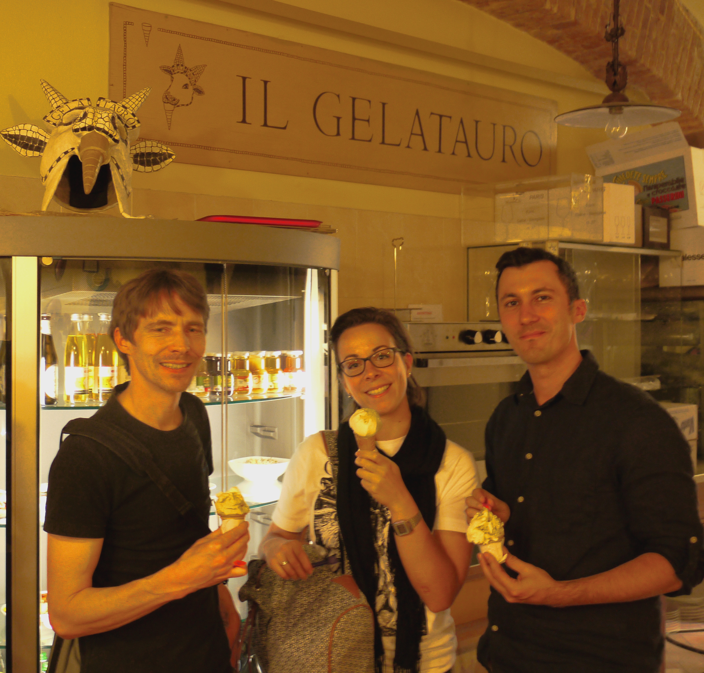

# About GeLaTo 
## GEnes and LAnguages TOgether: a resource for multidisciplinary studies on human genetic and linguistic variation

### Credits

GeLaTo was created by Chiara Barbieri, Damián Blasi and Robert Forkel.

Chiara Barbieri: genetic data curation, population genetics analysis, database assembly. 

Damián Blasi: conceptualization, project name.

Robert Forkel: database structure and web implementation in CLDF.

The concept of GeLaTo was developed from conversations at the Department of Linguistic and Cultural Evolution at the Max Planck Institute for the Science of Human History, Jena, Germany, and the dataset was assembled at the University of Zurich.
Concept supervision: Russell Gray, Balthasar Bickel, Kentaro Shimizu.

The curation of the dataset for glottocode assignation was performed by Barbieri, Blasi and Forkel with the expertise of Harald Hammarström, and the support of various contributors: Søren Wichmann, Simon J. Greenhill, Balthasar Bickel, Russell Gray, Natalia Chousou-Polydouri, Paul Heggarty, Tom Güldemann, Matthias Urban, Brigitte Pakendorf, Jessica Ivani, Kellen Parker van Dam, Anne-Maria Fehn, Hiba Babiker, Nora Muheim.  
Details on the contribution for each genetic population is listed in the dataset curation notes at https://github.com/gelato-org/gelato-data/blob/master/datasets/HumanOrigins_AutosomalSNP/samples.csv 

Chiara Barbieri was supported by funds from the [URPP Evolution in Action](https://www.evolution.uzh.ch/en.html) program of the University of Zurich and from the [NCCR Evolving languages](https://evolvinglanguage.ch/) of the Swiss National Science Fundation.  

### Contributing ⇫ 
Glottolog data is curated in a public repository at  https://github.com/gelato-org/gelato-data. We welcome suggestions for:
* improving the glottocode matches to the genetic populations
* suggesting genetic publications to include, which satisfy the following criteria: data compatible to the genetic panels considered, and population samples with an anthropological/linguistic background description
* suggesting new genetic analysis and variables to compute over the dataset

### Publications ⇫ 
Academic publications which deal with GeLaTo include:

**202X**

Barbieri, Blasi et al. 202X

A global analysis of matches and mismatches between human genetic and linguistic histories.
BibTeX
